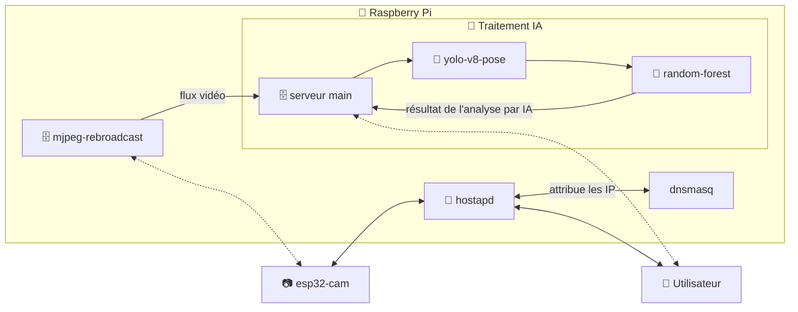

# Adaptation de l'implémentation du modèle yolo-v8 sur Hailo 8L et Raspberry Pi 5

Dans le cadre du projet G1-G2 à l'École Centrale de Lille, nous avons besoin d'implémenter un système d'analyse en temps réel d'un environnement de chantier, afin de détecter des éventuelles postures dangereuses au long terme

# L'architecture du système

# Installation

Se référer au `install.md`, situé [ici](https://github.com/r0bertleberger/hailo-rpi5-examples/blob/main/docs/install.md)

# Utilisation 

Il faut commencer par "allumer" l'interface et lui donner la bonne ip (`ifconfig wlan0 10.0.0.1 netmask 255.255.255.0 up`) puis démarrer les deux services (`dnsmasq` puis `hostapd`). Il faut ensuite lancer deux terminaux, et éxécuter les deux scripts pour chaque serveur (`serveur-mjpeg.py` et `serveur.py`)
