# Adaptation de l'implémentation du modèle yolo-v8 sur Hailo 8L et Raspberry Pi 5

Dans le cadre du projet G1-G2 à l'École Centrale de Lille, nous avons besoin d'implémenter un système d'analyse en temps réel d'un environnement de chantier, afin de détecter des éventuelles postures dangereuses au long terme

# L'architecture du système

```mermaid
graph LR;
    C[📷 esp32-cam] 

    subgraph "🍓 Raspberry Pi"
        direction TB
        AP[📡 hostapd]
        DHCP[dnsmasq]
        Mjpeg[🗄️ mjpeg-rebroadcast]
        Main[🗄️ serveur main]

        AP <--> |attribue les IP| DHCP
        Mjpeg --> |flux vidéo| Main

        subgraph "🧠 Traitement IA"
            direction TB
            yolo[🤖 yolo-v8-pose]
            random[🤖 random-forest]

            Main --> yolo
            yolo --> random
            random --> |résultat de l'analyse par IA| Main
        end
    end

    U[👤 Utilisateur]

    C <--> AP
    Mjpeg <-.-> C
    Main <-.-> U
    AP <--> U
```

# Installation

Se référer au `install.md`, situé [ici](https://github.com/r0bertleberger/hailo-rpi5-examples/blob/main/docs/install.md)

# Utilisation 

Il faut commencer par "allumer" l'interface et lui donner la bonne ip (`ifconfig wlan0 10.0.0.1 netmask 255.255.255.0 up`) puis démarrer les deux services (`dnsmasq` puis `hostapd`). Il faut ensuite lancer deux terminaux, et éxécuter les deux scripts pour chaque serveur (`serveur-mjpeg.py` et `serveur.py`)
